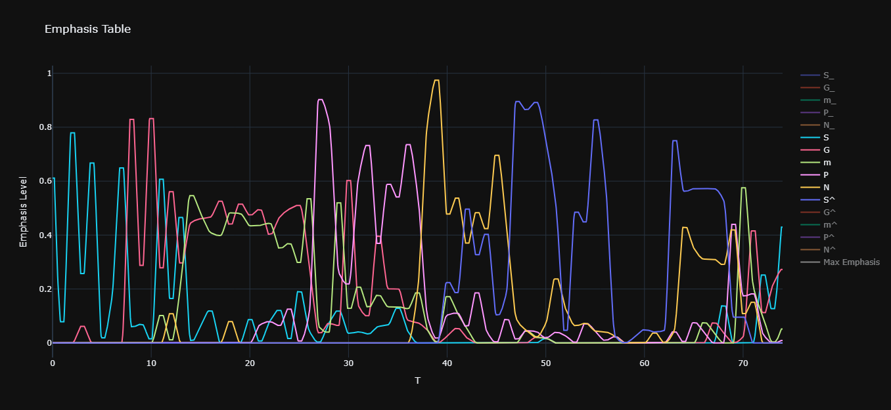

# Generating Hindustani Vistaar using Markov Chains, Emphasis, and Tagging

[](https://opensource.org/licenses/MIT)
[](https://www.python.org/downloads/release/python-390/)

This repository contains the code and resources for a research project on generating *vistaar*, a form of melodic improvisation in Hindustani classical music. It uses a novel approach that combines Markov chains with emphasis modeling and a high-level tagging system to create musically coherent and structurally sound improvisations.

This is my first research project and is currently a work in progress. I'm excited to share my journey and findings with the community!



> ### For more details about the project, please see [this presentation](https://docs.google.com/presentation/d/1idMoJkqjhkZX9B8zF153Ynrg7MWf7jAkYl5wp228g3U/edit?slide=id.g36191df9461_0_1491#slide=id.g36191df9461_0_1491).

## 🎵 About The Project

In Hindustani classical music, a **Raga** provides the melodic framework for improvisation. A **Vistaar** is the gradual, improvised unfolding of that raga, characterized by its use of cadence, patterns, and subtle nuances.

While prior work has focused on generating musical sequences within a raga and generating vocal contours akin to nuances, the specific, complex task of generating a complete vistaar has been largely unexplored. This project aims to bridge that gap by going beyond simple sequence generation and exploring a middle ground between the two areas previously explored.

All musical samples and models in this project are currently focused on **Raga Amritvarshini** in the G# scale.

### Motivation

Many contemporary music generation models (e.g., Google Magenta, OpenAI MuseNet) rely on large, complex architectures that require vast amounts of data and computational power. Such resources are not always readily available for specific domains like Hindustani music.

This project takes a different approach by:

* Using simpler, interpretable models that require less data and are easier to train.
* Focusing on musically intuitive concepts rather than purely data-driven methods.

## 🛠️ Methodology

My approach to generating vistaar involves three main components, each building upon the last to create a more structured and coherent musical output.

### 1. Initial Experiments: Markov Chains

The initial approach used a standard Markov model to generate sequences of notes. While capable of producing note sequences, the results lacked musical coherence and often failed to adhere to the raga's rules. Incorporating genetic algorithms improved adherence to raga rules, but the output still lacked the intentional, phrase-based structure of a real vistaar.

### 2. Introducing "Emphasis"

To address the lack of coherence, I introduced the concept of **emphasis**: a measure of a note's relevance within a musical phrase. I manually annotated the emphasis of each note in a training vistaar, considering its duration and its role (e.g., as part of a cadence or a transient pattern).

This data is used to create continuous emphasis curves for each note over the course of the vistaar. These curves dynamically guide the generation process by re-weighting the Markov model's transition probabilities, encouraging the selection of notes that are contextually important at any given moment.

### 3. Upper-Level Tag System

Even with emphasis, the model lacked a high-level understanding of a vistaar's overall structure. To solve this, I developed a **tagging system** where each phrase is assigned a functional role:

* **I (Introduce):** Introduce a new note (e.g., `I S` for introducing Sa).
* **E (Explore):** Explore around a note (e.g., `E G` for exploring Ga).
* **C (Close):** Close a melodic section.
* **T (Transition):** Transition to another note.
* **R (Recap):** Recap a portion of the vistaar.

Separate Transition Probability Matrices (TPMs) were created for each tag-and-note combination, allowing the model to learn the specific melodic patterns associated with different functions. A final high-level Markov chain generates a sequence of these tags, which in turn orchestrates the entire vistaar generation, providing a robust, hierarchical structure.

## 📈 Current Status & Limitations

This project is still under active development. Key limitations include:

* **Data Scarcity:** The models are currently trained on a single, manually annotated vistaar. More data is needed to improve variety and generalization.
* **Subjective Annotation:** The emphasis and tag annotations are manual and based on my own musical interpretation.
* **Missing Nuances:** While the system represents cadences well, it does not yet capture the more subtle microtonal variations and rhythmic nuances of a human performance.

##### While these limitations are outside the scope of this specific project, I'm excited to come back to them in the future.

## 📆 Future Goals for This Project

* **Evaluation:** Have the generated music evaluated by Hindustani music experts and/or develop a quantitative scoring function to guide model improvements.
* **Expand the Dataset:** Annotate and incorporate more vistaars to create a more robust and varied generative model.
* **Integration:** Explore integration with other music generation tools, such as [GaMaDHaNi](https://github.com/snnithya/GaMaDHaNi) for vocal synthesis.
* **Automate Annotation:** Investigate methods to automate the emphasis and tag annotation process.

## ⚙️ Getting Started

To get a local copy up and running, follow these simple steps.

### Prerequisites

* Python 3.9+

### Installation

1. Clone the repository:

   ```sh
   git clone [https://github.com/kidkoder432/emphasis_markov.git](https://github.com/kidkoder432/emphasis_markov.git)
   ```
2. Navigate to the project directory:

   ```sh
   cd emphasis_markov
   ```
3. Install the required packages:

   ```sh
   pip install -r requirements.txt 
   ```

   or

   ```sh
   pip3 install -r requirements.txt
   ```
4. To generate a vistaar, run the main script:

   ```sh
   py generate_fsm.py
   ```

   or

   ```sh
   python3 generate_fsm.py
   ```

## 📂 Folder Structure

* Raga and swar-related data files are in `raga_data/`
* Scripts for training (loading JSON files, calculating emphasis curves, etc.) are in `training/`
* Data files for the model such as emphasis curves and transition matrices are in `model_data/` as pickled files
* Generated outputs (text and MIDI) as well as log files are in `output/`
* Old unused files are in `archive/` for reference, but are not meant to be used directly.

## 🎧 Audio Samples

Audio samples for this project are available in the `samples/` folder. They are also linked at relevant sections in the presentation.

## 📚 References

This work is inspired by and builds upon the research of others in the field.

1. Das, Dipanjan, and Monojit Choudhury. "Finite state models for generation of Hindustani classical music." *Proceedings of International Symposium on Frontiers of Research in Speech and Music.* 2005.
2. Shikarpur, Nithya, et al. "Hierarchical Generative Modeling of Melodic Vocal Contours in Hindustani Classical Music." *arXiv.* arXiv:2408.12658. 2024.


## 🙏 Acknowledgments

I would like to express my sincere gratitude to my guru, **Shri Mahesh Kale**, for over eight years of training in Hindustani Classical music, which has been the foundation and inspiration for this project.

## 📬 Contact

I'm still looking for a mentor for this project to help me take it from a proof-of-concept to a publishable result. If you're interested in collaborating, don't hesitate to reach out to me!

**Prajwal Agrawal**

* **Email:** [`findprajju@gmail.com`](mailto:findprajju@gmail.com)
* **GitHub:** [`kidkoder432`](https://github.com/kidkoder432)
* **Discord:** `kidkoder`
